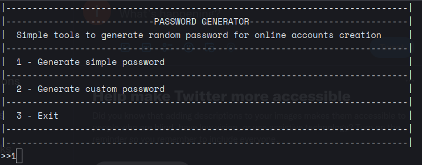
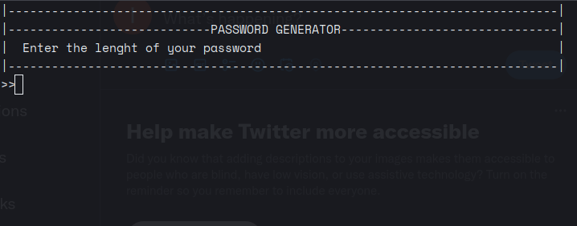
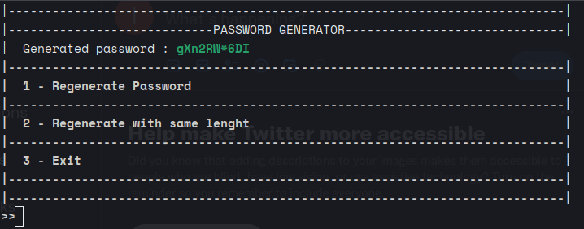
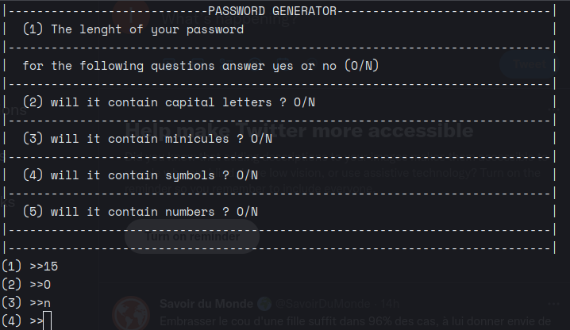
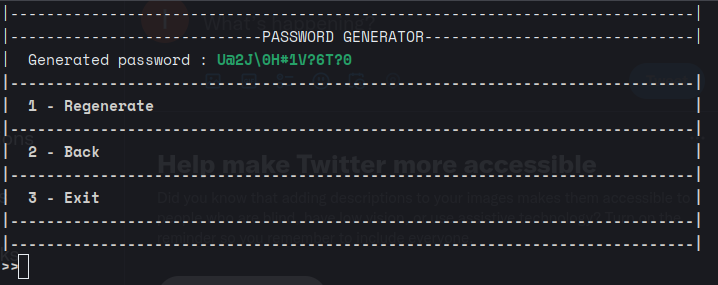

Python password Generator
========================

This project is a tool that will allow you to generate random passwords according to the size you choose and the needs (uppercase, lowercase, symbols, numbers)

---------------

after cloning the project locally, move to the directory to be able to perform all operations

Installation 
============
To install all project dependancies , currently there is no dependancy

```
make init 
```

---
Run
===

```
make run
```

---------------

If you want to ocntribute ``setup.py`` 
<https://github.com/LekeneCedric/password_generator/issues>

Preview
===




